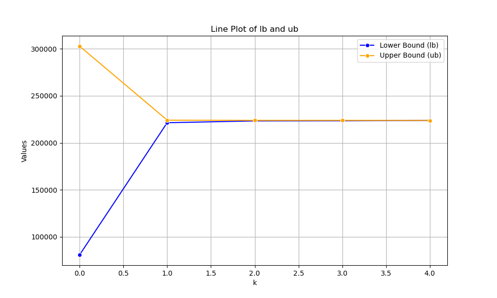
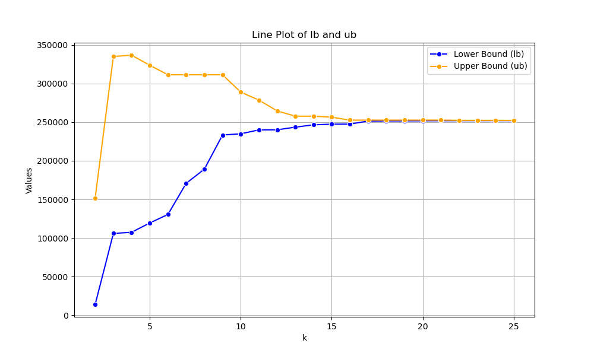

# Two-Stage-Robust-Optimization

This project is my personal replication of 

>"Zeng B, Zhao L. Solving two-stage robust optimization problems using a column-and-constraint generation method[J]. Operations Research Letters, 2013, 41(5): 457-461."

,which is programmed by Python and solved by Gurobi solver.

## Recent Plan
Running several cases to demonstrate the difference between CCG and BD.

## Directory Description
**store**: Storage of failed and archived works. No need to read them.

**deterministic_model**: The simplest deterministic ones. Just for a quick check.

**CCG**:
+ CCG_final_example.py -- Replecation of the numerical sample using column and constraint generation.

+ CCG_encapsulation.py -- Code for a general problem of Location-Transportation Problem using CCG, with facility number and customer number customized. For example, when set facility number equals 30 and customer number equals to 30, the code yield the following convergence plot:

**BD**:
+ BD_smallcase.py -- Replecation of the numerical sample using benders decomposition.

+ BD_encapsulation.py -- Code for a general problem of Location-Transportation Problem using BD, with facility number and customer number customized. For example, when set facility number equals 30 and customer number equals to 30, the code yield the following convergence plot:

